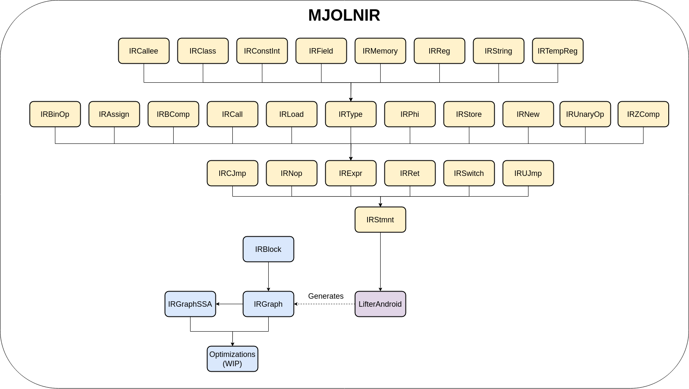
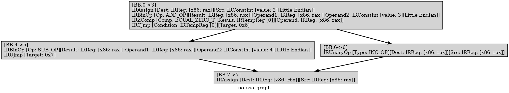

# KUNAI-static-analyzer

Tool aimed to provide a binary analysis of different file formats through the use of an Intermmediate Representation.

## Installation

### Old way (not recommended)

Kunai has a couple of dependencies, one of them can be downloaded in the **external** folder, to do that just run the next command:

```console
https://github.com/Fare9/KUNAI-static-analyzer.git
cd KUNAI-static-analyzer
git submodule update --init --rebase --recursive
```

With this, you will download the **zip** external dependency that can be compiled and installed next. The library **libspdlog-dev** will be also installed for logging in its version *1:1.5.0-1*, for doing that we can use the script you'll find in the root of the folder with the next command, the script right now is only for debian based distributions, you can install the dependencies in the next way:

```console
./debian_distros_installer.sh dependencies
```

This step is also run if you want to build Kunai using the same script with the next command:

```console
./debian_distros_installer.sh build
```

Or if you want to build using a debug configuration:

```console
./debian_distros_installer.sh debug
```

In case you want to install dependencies, compile Kunai and finally install it, do it with the next command:

```console
./debian_distros_installer.sh install
```

### CMake (recommended)

In order to improve the experience of compilation and installation, we have moved to *CMake*, so in order to build **Kunai** you can follow the next commands, the commands must be run from the root folder of the project:

```console
cmake -B build -S .
```

Now we build the libraries and all the other binaries from **Kunai**, we can specify with *-j* the number of processes to run in parallel so the compilation goes faster:

```console
cmake --build build -j<number of processes>
```

Finally for the installation we can run the next command, for installing the library in the system the command must run as *super user*:

```console
sudo cmake --build build/ --target install
```

## Project Structure

The next files/folders are included in the project:

* **doc/**: doxygen documentation automatically generated when files are merged into **main** branch, you shouldn't touch nothing here (or at least is not expected).
* **example-scripts/**: KUNAI is intended to be a library for analyst writing simple *C++* programs for analyzing *DEX* (and in the future other file formats) files, here there will be pretty easy examples that allows you to quickly get in touch with KUNAI library.
* **external/**: all the libraries that this project depends on. This could be included as a dependency for installing into system, or as an external project in here.
    * **external/zip/**: very simple library for unziping files, this is used for extracting all the files from an *apk* file, you need to retrieve it with make.sh or cloning repo with submodules.
* **projects/**: stand-alone binaries that are compiled together with KUNAI that are intended for testing or as tools that comes with KUNAI, even when these can be checked for learning how to use KUNAI, some headers or dependencies can be included in other ways than those in **example-scripts**.
* **src/**: source code of KUNAI, here are all the C++ classes structured in folders of KUNAI project.
    * **src/APK/**: code to manage APK files, an APK is a zip file which contains all the necessary files for running an application.
    * **src/DEX/**: code of KUNAI's DEX analysis.
    * **src/DEX/parser/**: code with DEX structure for file parsing, related structures are joined in the same file with different classes.
    * **src/DEX/DVM/**: utilities for the Dalvik machine, this contains opcodes, instructions, a linear sweep disassembler, and other constants from the DVM.
    * **src/DEX/Analysis/**: classes that contains utilities for the analyst, these includes managing all the DEX files as just one, it contains the disassembler, it allows managing classes, methods, fields and strings.
    * **src/Utils/**: utilities used by KUNAI.
    * **src/mjolnIR/**: code of KUNAI's Intermmediate Representation.
    * **src/mjolnIR/Analysis/**: classes written for applying different types of analysis to the Intermmediate Representation, some of them can be useful in deobfuscation.
    * **src/mjolnIR/Lifters/**: code to lift the disassembled instructions to KUNAI's Intermmediate Representation instructions.
    * **src/includes/KUNAI/**: all KUNAI's headers structured following previous convention.
    * **src/includes/KUNAI/Exceptions/**: all the custom exceptions used in KUNAI.

## DEX


KUNAI offers several classes for the analysis of DEX files, this part of KUNAI's framework is based in [Androguards](https://github.com/androguard/androguard) code, but it follows another working flow, the DEX analysis is divided in three *main* parts:

* DEX Parser
* DEX Disassembler
* DEX Analysis

Instead of retrieving all these fields with one call to a function, we divided them so you can get only with want you want to work, so each one gives different utilities:

### DEX Parser

If you get an object from *KUNAI::DEX::DEX* class, you will get a parsed DEX object, so the only basic work that KUNAI does for you is to parse DEX headers, you have two ways for getting *KUNAI::DEX::DEX* object, this can be a *std::unique_ptr* or a *std::shared_ptr* depending on the function used to get one:

```cpp
std::unique_ptr<DEX> get_unique_dex_object(std::ifstream &input_file, std::uint64_t file_size)
std::shared_ptr<DEX> get_shared_dex_object(std::ifstream &input_file, std::uint64_t file_size)
```

For the moment this calls from the API receives a *std::ifstream* from the file and a *std::uint64_t* with the file_size.

Once we have received the object, we can check if parsing was correct or not, in order to continue working with the object.

```cpp
...
auto dex = KUNAI::DEX::get_unique_dex_object(dex_file, fsize);

if (!dex->get_parsing_correct())
{
    std::cerr << "[-] Parsing of DEX file was not correct." << std::endl;
    return 1;
}
```

Now if we know that parsing is correct, we can access to the parser object from the class *KUNAI::DEX::DexParser*, from this object, other different objects could be accessed:

* DexHeader
* DexStrings
* DexTypes
* DexProtos
* DexFields
* DexMethods
* DexClasses

```cpp
...
auto dex = KUNAI::DEX::get_unique_dex_object(dex_file, fsize);
...
auto dex_parser = dex->get_parser();
...
auto dex_header = dex_parser->get_header();
auto dex_strings = dex_parser->get_strings();
auto dex_types = dex_parser->get_types();
auto dex_protos = dex_parser->get_protos();
auto dex_fields = dex_parser->get_fields();
auto dex_methods = dex_parser->get_methods();
auto dex_classes = dex_parser->get_classes();
```

## DEX Disassembler

A DEX Linear sweep disassembler is implemented following the code from **Androguard**, this can also be retrieved from *KUNAI::DEX::DEX* object, if you retrieve the disassembler you obtain an object of the class *KUNAI::DEX::DexDisassembler*, but the code is not disassembled yet, to do that we will have to call the next function:

```cpp
...
auto dex = KUNAI::DEX::get_unique_dex_object(dex_file, fsize);
...
auto dex_disassembler = dex->get_dex_disassembler();
dex_disassembler->disassembly_analysis();
```

With this we would have disassembled the DEX instructions for each method, but we should apply check to know that disassembler was correct!

```cpp
...
auto dex = KUNAI::DEX::get_unique_dex_object(dex_file, fsize);
...
auto dex_disassembler = dex->get_dex_disassembler();
dex_disassembler->disassembly_analysis();

if (!dex_disassembler->get_disassembly_correct())
{
    std::cerr << "[-] Disassembly was incorrect, cannot show instructions." << std::endl;
    return 1;
}
```

Now we can access a complex structure to access to the disassembled instructions with the next function:

```cpp
std::map<std::tuple<std::shared_ptr<ClassDef>, std::shared_ptr<EncodedMethod>>,std::map<std::uint64_t, std::shared_ptr<Instruction>>> get_instructions();
```

## MjolnIR



IR written for generic analysis of different file formats and binary architectures, this IR allows us to represent binaries in a higher language, then create Control-Flow graphs, Data-Flow graphs, etc. MjolnIR is intended to support by default three-address code and Abstract-Syntax Tree (AST).

### IRStmnt

At the top of the IR we have the statements, these will be every instruction from the IR that could be executed by the program, between these IRStmnt are the expressions (explained later), but more specific statements are those that change the Control-Flow Graph from the function/method, these are conditional and unconditional jumps, return statements, etc.

```
IRStmnt     -->     IRUJmp   |
                    IRCJmp   |
                    IRRet    |
                    IRBlock  |
                    IRNop    |
                    IRSwitch |
                    IRExpr 

IRUJmp      -->     jmp addr
IRCJmp      -->     if (IRStmnt) { jmp addr } NEXT fallthrough_addr
IRRet       -->     Ret IRStmnt
IRBlock     -->     IRStmnt1, IRStmnt2, ..., IRStmntN
```

### IRExpr

The IR involves to support various instructions from the code, these are what we call IRExpr, these kind of instructions don't modify the control flow of the code but apply different kind of operations to the variables/registers/memory in the program.

```
IRExpr    -->   IRBinOp   |
                IRUnaryOp | 
                IRAssign  |
                IRPhi     |
                IRCall    |
                IRLoad    |
                IRStore   |
                IRZComp   |
                IRBComp   |
                IRNew     |
                IRAlloca  |
                IRType    
                
IRBinOp   -->   IRExpr <- IRExpr bin_op_t IRExpr
IRUnaryOp -->   IRExpr <- unary_op_t IRExpr
IRAssign  -->   IRExpr <- IRExpr
IRPhi     -->   IRExpr <- IRExpr, IRExpr, ..., IRExpr
IRCall    -->   IRExpr(IRExpr1, IRExpr2, ..., IRExprN)
IRLoad    -->   IRExpr <- *IRExpr
IRStore   -->   *IRExpr <- IRExpr
IRZComp   -->   IRExpr zero_comp_t
IRBComp   -->   IRExpr comp_t IRExpr
IRNew     -->   IRExpr <- new IRExpr
IRAlloca  -->   IRExpr <- new IRExpr[IRExpr]

# kind of operations
bin_op_t  -->   ADD_OP_T   |
                SUB_OP_T   |
                S_MUL_OP_T |
                U_MUL_OP_T |
                S_DIV_OP_T |
                U_DIV_OP_T |
                MOD_OP_T
unary_op_t   -->   INC_OP_T    |
                   DEC_OP_T    |
                   NOT_OP_T    |
                   NEG_OP_T    |
                   CAST_OP_T   |
                   Z_EXT_OP_T  |
                   S_EXT_OP_T
zero_comp_t  -->   EQUAL_ZERO_T |
                   NOT_EQUAL_ZERO_T
comp_t       -->   EQUAL_T              |
                   NOT_EQUAL_T          |
                   GREATER_T            |
                   GREATER_EQUAL_T      |
                   LOWER_T              |
                   ABOVE_T              |
                   ABOVE_EQUAL_T        |
                   BELOW_T                           
```

### IRType

For supporting the types we find in the binary code, we have written a serie of classes which derive from a super class named **IRType**, as derived classes we have: *registers*, *constant values*, *strings*, *memory*, *callee types*.

```
IRType   -->   IRReg |
               IRTempReg |
               IRConstInt |
               IRMemory |
               IRString |
               IRCallee |
               IRClass  |
               IRFundamental |
               NONE

IRFundamental   --> F_BOOLEAN   |
                    F_BYTE      |
                    F_CHAR      |
                    F_DOUBLE    |
                    F_FLOAT     |
                    F_INT       |
                    F_LONG      |
                    F_SHORT     |
                    F_VOID
```

### Implementations on the IR

Kunai's IR implements each function analyzed as an **IRGraph**, this graph contains all the blocks as nodes, and the connections between blocks as edges. Recently an implementation of an **SSA** form for the **IRGraph** has been implemented, but this is not as stable as the previous one. In the next images you can see the differences between both:



And the SSA version:


### Dalvik

Dalvik has been the first "assembly" language to be supported with **MjolnIR** inside of **KUNAI**, you can check all the opcodes and its translation in [Dalvik Opcodes](./doc/MJOLNIR/dalvik_opcodes.md)

### References

Here there are some references used as ideas and base for the design and/or implementation of **KUNAI** and **MjolnIR**:

* Projects:
    * [Androguard](https://github.com/androguard/androguard): Androguard is a static analysis tool aimed to analyze Android applications and DEX files.
    * [Miasm](https://github.com/cea-sec/miasm/tree/master): Miasm is a symbolic execution engine written in python which allows to analyze statically binaries using its SymbEx engine and the possibility to optimize/simplify the generated code.
    * [VEX](https://github.com/angr/vex): VEX is a binary lifter and an IR that Angr uses as its own IR for doing symbolic execution.
    * [Maat](https://github.com/trailofbits/maat): Maat is a symbolic execution engine written in C++ by trail of bits, it uses Ghidra P-Code as its Intermediate Representation.
    * [Cyx2](https://github.com/flylai/cyx2): Code for generating the SSA form of the graph.
* Papers:
    * [Wire -- A Formal Intermediate Language for Binary Analysis](https://ieeexplore.ieee.org/document/6296015)
    * [REIL: A platform-independent intermediate representation of disassembled code for static code analysis](https://static.googleusercontent.com/media/www.zynamics.com/en//downloads/csw09.pdf)
    * [Dexpler: Converting Android Dalvik Bytecode to Jimple for Static Analysis with Soot](https://arxiv.org/pdf/1205.3576.pdf)
* Books:
    * [Advanced Compiler Design and Implementation](https://www.amazon.com/-/es/Steven-Muchnick/dp/1558603204)
    * [An Introduction to the Theory of Optimizing Compilers](https://www.amazon.com/-/es/Jonas-Skeppstedt/dp/172593048X)
    * [Introduction to Compilers and Language Design: Second Edition](https://www3.nd.edu/~dthain/compilerbook/compilerbook.pdf)

## Compiled in

KUNAI has been compiled in next systems:

* Arch-Linux x86-64 - g++ 11.1
* elementary OS 6.1 Jólnir x86_64 - g++ 9.3.0
* elementary OS 6.1 Jólnir x86_64 - clang version 10.0.0-4ubuntu1
* elementary OS 6.1 Jólnir x86_64 - clang version 15.0.6

## License

This project is licensed under a MIT License, please check the file [LICENSE](./LICENSE) to find more information about it.

## Contact

For any question, or issues about the tool you can always refer to the issues from the project, or write us to our gmail address: kunai(dot)static(dot)analysis(at)gmail(dot)com

## Cite this project

```
@MISC {KUNAI,
  author       = "Eduardo Blazquez",
  title        = "Kunai-Static-Analyzer",
  howpublished = "https://github.com/Fare9/KUNAI-static-analyzer",
  month        = "may",
  year         = "2021"
}
```
=======
Tool aimed to provide a binary analysis of different file formats through the use of an Intermmediate Representation.

## Acknowledgements

This project has received funding from the European Union's Horizon 2020 research and innovation programme under grant agreement No. 101021377


